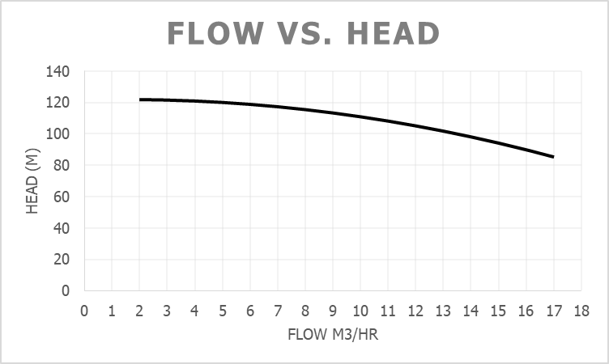
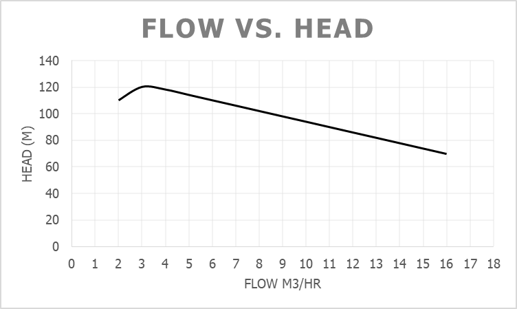

When developing a Mechanical Run Test procedure, pump curves are usually attached as a part of the procedure. When plotting the head against flow, a typical centrifugal pump curve usually indicates a smooth decreasing trend (fig. 1).

Figure. 1 - Typical Pump Curve

However, there are instances where the pump curve provided by the manufacturer exhibits a rising, peaking, and falling trend (fig.2). This kind of pump characteristic, which we usually refer to as 'drooping' or 'hunchback', can cause few problems during pump switching operations if not carefully addressed. 

Figure. 2 - Hunchback or Drooping Curve (8270-P-101B)

For example, let's consider a main pump, 8270-P-101-A, running at a normal flow rate of 5 m3/hr (with a head of 114 m). If, for any reason, a switch is required to the standby pump, 8270-P-101-B, the following procedure is usually followed. Once the standby pump is primed, the operator starts the pump while keeping the main pump running. Then, the operator slowly opens the discharge valve of the standby pump to bring it online. After confirming stable standby pump pressure and detecting no abnormal sounds, the operator proceeds to shut off the standby pump.

However, since the pump 8270-P-101-B exhibits a hunchback curve (as shown in fig. 2), during the gradual opening of the discharge valve, the discharge head will increase instead of decreasing until it matches the discharge head of the still-running main pump, 8270-P-101-A. This results in the discharge head of 114 m corresponding to two flow rates: 5 m3/hr for the main pump (8270-P-101-A) and 2.4 m3/hr for the standby pump (8270-P-101-B). In this situation, the standby pump may become stuck running at the low flow rate of around 2.4 m3/hr, leading to cavitation and pressure fluctuations. Without special intervention, such as manipulation of the main pump's discharge valve or adjusting the flow control valve, the standby pump cannot be stabilized. 

In most cases, vendors are aware and have considered this scenario during manufacturing. The normal operating flow rate of the main pump would typically be well outside the inverted U-curve. This can help avoid situations where two flow rates correspond to a single pump head value. If this is not the situation, it becomes necessary to have a discussion with both the vendor and the client. This discussion aims to establish a procedure for stabilizing the standby pump using a special operational control method. This method could involve manipulating the discharge valve of the main pump or adjusting the opening of the flow control valve during the switching operation.
